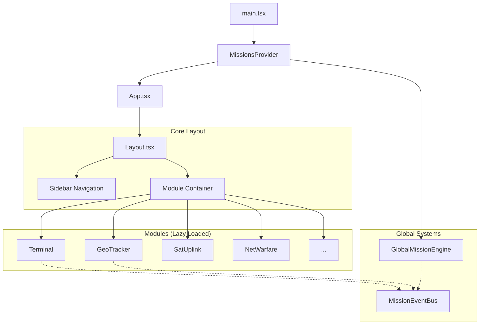
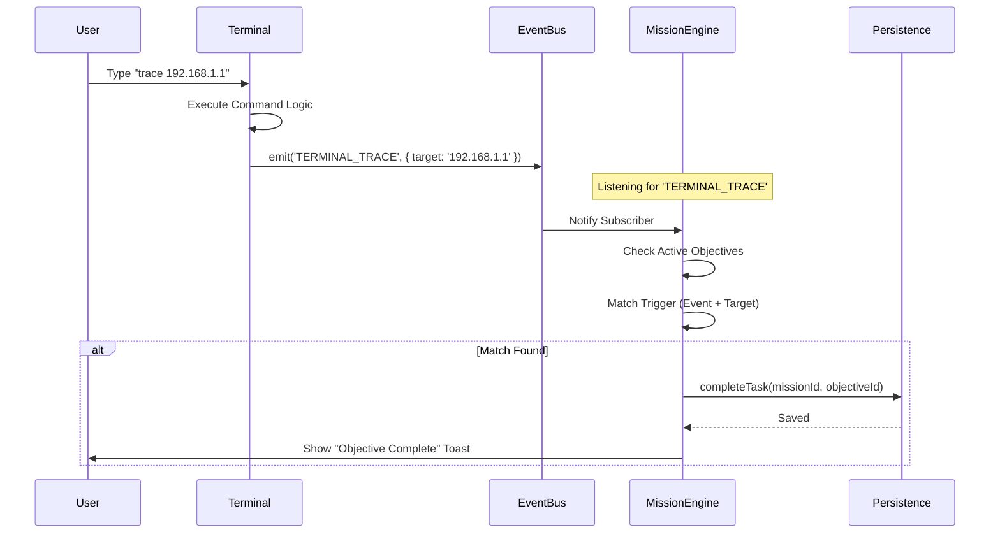

# 👩‍💻 Developer Contributor Handbook

Welcome to the **CyberOS Engineering Guide**. This document reveals the "guts" of the system—how the React components, mission engine, and event bus all wire together. Read this if you want to fix bugs, add new modules, or understand the architecture.

---

## 1. High-Level Architecture

CyberOS is a **Single Page Application (SPA)** built with **React**, **Vite**, and **TypeScript**. It uses a modular architecture where "apps" (like Terminal, Sat Uplink) are isolated modules that plug into a main layout.

### System Diagram



### Component Breakdown

*   **`main.tsx`**: The entry point. It mounts the React app into the DOM.
*   **`MissionsProvider`** (`src/modules/missions/MissionsContext.tsx`): The "God Object" for mission state. It:
    *   Loads all mission JSON files from `src/modules/missions/data/`.
    *   Manages the `activeMissionId` and `completedMissionIds`.
    *   Persists progress to `localStorage` (`cyberos_mission_progress`).
    *   Exposes the `useMissions()` hook so any component can access the current mission data.
*   **`App.tsx`**: Sets up the React Router and defines the routes for each module.
*   **`Layout.tsx`**: The main shell. It renders the `Sidebar` (navigation) and the `Outlet` where modules appear.
*   **`GlobalMissionEngine`**: A headless component that runs *outside* the specific module routes. This ensures that if you are in the "Terminal" view, the engine is still listening for events that might happen in the background or be triggered by global hotkeys.

---

## 2. Directory Structure

```text
src/
├── components/         # Shared UI components (Buttons, Modals, etc.)
├── hooks/              # Global hooks (useMissionState, useSound)
├── modules/            # THE MEAT. Each "app" is a folder here.
│   ├── terminal/       # Terminal module logic & UI
│   ├── geo_tracker/    # Map module
│   ├── missions/       # Mission System Core (Engine, Data, Context)
│   ├── directory/      # Directory module (Profiles, Random User Logic)
│   └── ...
├── layout/             # Main app shell (Sidebar, Header)
└── styles/             # Global Tailwind & CSS
```

---

## 3. The Mission System (The "Brain")

The Mission System is **Event-Driven**. It doesn't poll for changes; it reacts to events emitted by modules.

### Core Components

1.  **`MissionsContext.tsx`**: The React Context that holds the "Static" mission data (title, description) and the "Dynamic" high-level state (active/completed).
2.  **`MissionEventBus.ts`**: A singleton Pub/Sub system. It allows decoupled communication. The Terminal doesn't know about the Mission Engine; it just shouts "I TRACED AN IP!" and the Engine listens.
3.  **`GlobalMissionEngine.tsx`**: The listener. It subscribes to the Event Bus. When an event comes in, it checks the `activeMission`'s objectives. If the event matches a trigger, it marks the objective as complete.
4.  **`useMissionState.ts`**: The persistence layer. It handles the granular "checklist" state (e.g., "Objective 1 of Mission 3 is done").

### Event Flow Diagram

Here is what happens when a user runs a command like `trace 192.168.1.1` in the Terminal:



---

## 4. Module Architecture

Each module (e.g., `src/modules/terminal/`) is self-contained.

### Data Injection Pattern
Modules must be able to receive "fake data" from the active mission. This is handled via the `activeMission` object from `useMissions()`.

**Example: SatUplink.tsx**
```typescript
const { activeMission } = useMissions();

// 1. Load Default Data
const [satellites, setSatellites] = useState(defaultSatellites);

// 2. Merge Mission Data (Effect)
useEffect(() => {
    if (activeMission?.moduleData?.Satellite) {
        // Deep merge mission-specific satellites over default ones
        const merged = mergeData(defaultSatellites, activeMission.moduleData.Satellite);
        setSatellites(merged);
    }
}, [activeMission]);
```

---

## 5. Adding a New Module

Want to add a "Drone Control" module? Follow these steps:

1.  **Create Directory**: `src/modules/drone_control/`
2.  **Create Main Component**: `DroneControl.tsx`
3.  **Register Route**: Add it to the router in `App.tsx` (or wherever routes are defined).
4.  **Add to Sidebar**: Update `src/layout/Sidebar.tsx` with a new icon and link.
5.  **Integrate Events**:
    *   Import `missionEventBus`.
    *   Emit events when cool stuff happens: `missionEventBus.emit('DRONE_LAUNCH', { id: droneId })`.

---

## 6. Key Technologies & Patterns

*   **[React 18](https://react.dev/)**: The core UI library.
*   **[Vite](https://vitejs.dev/)**: Fast build tool and dev server.
*   **[TypeScript](https://www.typescriptlang.org/)**: For type safety and better DX.
*   **[TailwindCSS](https://tailwindcss.com/)**: Utility-first CSS framework. We use it for the "Cyberpunk" aesthetic (Green/Black/Red).
*   **[Lucide React](https://lucide.dev/)**: Beautiful, consistent icons.
*   **[Leaflet](https://leafletjs.com/)**: Open-source JavaScript library for mobile-friendly interactive maps (`GeoTracker`).
*   **[OpenLayers](https://openlayers.org/)**: High-performance mapping library used for `EarthView` in Sat Uplink.
*   **[Aladin Lite v3](https://aladin.cds.unistra.fr/AladinLite/)**: Interactive sky atlas for `AstroView` in Sat Uplink.
*   **[Three.js](https://threejs.org/)**: 3D library used for the globe visualization in `SatUplink`.
*   **LocalStorage**: We persist state to `cyberos_mission_state` and `cyberos_mission_progress`.
*   **i18n (Internationalization)**: Custom context-based system (`src/core/registry.tsx`) using `en.ts` and `es.ts` for locale definitions.

---

## 7. Internationalization (i18n)

CyberOS supports multiple languages (currently English and Spanish).

### How to Translate a Component
1.  **Import the Hook**:
    ```typescript
    import { useLanguage } from '../../core/registry';
    ```
2.  **Use the `t` Function**:
    ```typescript
    const { t } = useLanguage();
    return <div>{t('module.key_name')}</div>;
    ```
3.  **Add Keys**:
    Add your keys to `src/locales/en.ts` and `src/locales/es.ts`.
    ```typescript
    // en.ts
    'module.key_name': 'Hello World',
    // es.ts
    'module.key_name': 'Hola Mundo',
    ```

### Dynamic Content & Templates
For content that requires translation but is structured as data (like file system templates or mission data), **avoid using JSON files**. Instead, use TypeScript files that export a function accepting the `t` translator.

**Example (`fs_templates.ts`):**
```typescript
export const getTemplates = (t: (key: string) => string) => [
    { name: t('template.name'), content: "..." }
];
```

Then in your component:
```typescript
const templates = useMemo(() => getTemplates(t), [t]);
```

---

## 7. External APIs

CyberOS integrates with real-world data APIs to enhance immersion.

### 🛰️ NASA APIs
Used in the **Sat Uplink** module.
*   **Base URL**: `https://api.nasa.gov`
*   **Endpoints**:
    *   `DONKI` (Space Weather Database Of Notifications, Knowledge, Information): For solar flare and geomagnetic storm alerts.
    *   `neo/rest/v1/feed` (Near Earth Object Web Service): For tracking asteroids.
    *   `GIBS` (Global Imagery Browse Services): WMTS/WMS endpoints for daily satellite imagery (MODIS, VIIRS).
*   **Key**: Requires an API Key (stored in `localStorage`).

### 🔭 Astronomy APIs
Used in the **Sat Uplink (AstroView)** module.
*   **Aladin Lite / HiPS**: Accesses hierarchical progressive surveys from CDS (Strasbourg) and other data centers.
*   **Surveys**:
    *   DSS2 (Optical)
    *   PanSTARRS (Optical)
    *   2MASS / AllWISE (Infrared)
    *   GALEX (UV)
    *   XMM-Newton (X-Ray)

### 📹 Windy.com API
Used in the **Surveillance** module.
*   **Base URL**: `https://api.windy.com`
*   **Endpoints**:
    *   `webcams/api/v3/webcams`: For fetching live webcam feeds.
    *   `webcams/api/v3/categories`: For filtering cams by type.
    *   `webcams/api/v3/countries`: For filtering cams by location.
*   **Key**: Requires a Windy API Key (stored in `localStorage`).

---

## 8. Debugging Tips

*   **Mission Debugging**: Open the browser console. The `GlobalMissionEngine` logs every event it receives.
*   **State Reset**: If things get weird, clear your Application > Local Storage. The system is robust enough to regenerate default state.

---

## 9. Directory Module
src/
├── components/         # Shared UI components (Buttons, Modals, etc.)
├── hooks/              # Global hooks (useMissionState, useSound)
├── modules/            # THE MEAT. Each "app" is a folder here.
│   ├── terminal/       # Terminal module logic & UI
│   ├── geo_tracker/    # Map module
│   ├── missions/       # Mission System Core (Engine, Data, Context)
│   ├── directory/      # Directory module (Profiles, Random User Logic)
│   └── ...
├── layout/             # Main app shell (Sidebar, Header)
└── styles/             # Global Tailwind & CSS
```

---

## 3. The Mission System (The "Brain")

The Mission System is **Event-Driven**. It doesn't poll for changes; it reacts to events emitted by modules.

### Core Components

1.  **`MissionsContext.tsx`**: The React Context that holds the "Static" mission data (title, description) and the "Dynamic" high-level state (active/completed).
2.  **`MissionEventBus.ts`**: A singleton Pub/Sub system. It allows decoupled communication. The Terminal doesn't know about the Mission Engine; it just shouts "I TRACED AN IP!" and the Engine listens.
3.  **`GlobalMissionEngine.tsx`**: The listener. It subscribes to the Event Bus. When an event comes in, it checks the `activeMission`'s objectives. If the event matches a trigger, it marks the objective as complete.
4.  **`useMissionState.ts`**: The persistence layer. It handles the granular "checklist" state (e.g., "Objective 1 of Mission 3 is done").

### Event Flow Diagram

Here is what happens when a user runs a command like `trace 192.168.1.1` in the Terminal:


---

## 4. Module Architecture

Each module (e.g., `src/modules/terminal/`) is self-contained.

### Data Injection Pattern
Modules must be able to receive "fake data" from the active mission. This is handled via the `activeMission` object from `useMissions()`.

**Example: SatUplink.tsx**
```typescript
const { activeMission } = useMissions();

// 1. Load Default Data
const [satellites, setSatellites] = useState(defaultSatellites);

// 2. Merge Mission Data (Effect)
useEffect(() => {
    if (activeMission?.moduleData?.Satellite) {
        // Deep merge mission-specific satellites over default ones
        const merged = mergeData(defaultSatellites, activeMission.moduleData.Satellite);
        setSatellites(merged);
    }
}, [activeMission]);
```

---

## 5. Adding a New Module

Want to add a "Drone Control" module? Follow these steps:

1.  **Create Directory**: `src/modules/drone_control/`
2.  **Create Main Component**: `DroneControl.tsx`
3.  **Register Route**: Add it to the router in `App.tsx` (or wherever routes are defined).
4.  **Add to Sidebar**: Update `src/layout/Sidebar.tsx` with a new icon and link.
5.  **Integrate Events**:
    *   Import `missionEventBus`.
    *   Emit events when cool stuff happens: `missionEventBus.emit('DRONE_LAUNCH', { id: droneId })`.

---

## 6. Key Technologies & Patterns

*   **[React 18](https://react.dev/)**: The core UI library.
*   **[Vite](https://vitejs.dev/)**: Fast build tool and dev server.
*   **[TypeScript](https://www.typescriptlang.org/)**: For type safety and better DX.
*   **[TailwindCSS](https://tailwindcss.com/)**: Utility-first CSS framework. We use it for the "Cyberpunk" aesthetic (Green/Black/Red).
*   **[Lucide React](https://lucide.dev/)**: Beautiful, consistent icons.
*   **[Leaflet](https://leafletjs.com/)**: Open-source JavaScript library for mobile-friendly interactive maps (`GeoTracker`).
*   **[OpenLayers](https://openlayers.org/)**: High-performance mapping library used for `EarthView` in Sat Uplink.
*   **[Aladin Lite v3](https://aladin.cds.unistra.fr/AladinLite/)**: Interactive sky atlas for `AstroView` in Sat Uplink.
*   **[Three.js](https://threejs.org/)**: 3D library used for the globe visualization in `SatUplink`.
*   **LocalStorage**: We persist state to `cyberos_mission_state` and `cyberos_mission_progress`.
*   **i18n (Internationalization)**: Custom context-based system (`src/core/registry.tsx`) using `en.ts` and `es.ts` for locale definitions.

---

## 7. Internationalization (i18n)

CyberOS supports multiple languages (currently English and Spanish).

### How to Translate a Component
1.  **Import the Hook**:
    ```typescript
    import { useLanguage } from '../../core/registry';
    ```
2.  **Use the `t` Function**:
    ```typescript
    const { t } = useLanguage();
    return <div>{t('module.key_name')}</div>;
    ```
3.  **Add Keys**:
    Add your keys to `src/locales/en.ts` and `src/locales/es.ts`.
    ```typescript
    // en.ts
    'module.key_name': 'Hello World',
    // es.ts
    'module.key_name': 'Hola Mundo',
    ```

### Dynamic Content & Templates
For content that requires translation but is structured as data (like file system templates or mission data), **avoid using JSON files**. Instead, use TypeScript files that export a function accepting the `t` translator.

**Example (`fs_templates.ts`):**
```typescript
export const getTemplates = (t: (key: string) => string) => [
    { name: t('template.name'), content: "..." }
];
```

Then in your component:
```typescript
const templates = useMemo(() => getTemplates(t), [t]);
```

---

## 7. External APIs

CyberOS integrates with real-world data APIs to enhance immersion.

### 🛰️ NASA APIs
Used in the **Sat Uplink** module.
*   **Base URL**: `https://api.nasa.gov`
*   **Endpoints**:
    *   `DONKI` (Space Weather Database Of Notifications, Knowledge, Information): For solar flare and geomagnetic storm alerts.
    *   `neo/rest/v1/feed` (Near Earth Object Web Service): For tracking asteroids.
    *   `GIBS` (Global Imagery Browse Services): WMTS/WMS endpoints for daily satellite imagery (MODIS, VIIRS).
*   **Key**: Requires an API Key (stored in `localStorage`).

### 🔭 Astronomy APIs
Used in the **Sat Uplink (AstroView)** module.
*   **Aladin Lite / HiPS**: Accesses hierarchical progressive surveys from CDS (Strasbourg) and other data centers.
*   **Surveys**:
    *   DSS2 (Optical)
    *   PanSTARRS (Optical)
    *   2MASS / AllWISE (Infrared)
    *   GALEX (UV)
    *   XMM-Newton (X-Ray)

### 📹 Windy.com API
Used in the **Surveillance** module.
*   **Base URL**: `https://api.windy.com`
*   **Endpoints**:
    *   `webcams/api/v3/webcams`: For fetching live webcam feeds.
    *   `webcams/api/v3/categories`: For filtering cams by type.
    *   `webcams/api/v3/countries`: For filtering cams by location.
*   **Key**: Requires a Windy API Key (stored in `localStorage`).

---

## 8. Debugging Tips

*   **Mission Debugging**: Open the browser console. The `GlobalMissionEngine` logs every event it receives.
*   **State Reset**: If things get weird, clear your Application > Local Storage. The system is robust enough to regenerate default state.

---

## 9. Directory Module

The Directory module serves as a global citizen database.

- **Data Source**: Fetches 100 random users from `randomuser.me` API at startup.
- **Mission Override**: Mission-specific profiles (injected via `DirectoryContext`) take precedence over random users if IDs match, or are appended to the list.
- **Encryption**: Profiles can be marked as `encrypted`. The `DirectoryContext` handles the decryption logic and emits `DIRECTORY_DECRYPT` events.

---

## 10. Document Viewer System

The **DocumentViewer** is a procedural document generation engine located in `src/modules/directory/components/DocumentViewer.tsx`. It renders JSON data into visually distinct, immersive "paper" documents.

### Architecture
The viewer uses a **Strategy Pattern**:
1.  **`DocumentViewer`**: The main container. It receives a `Document` object.
2.  **`ScannedDocumentWrapper`**: A HOC that adds paper textures, rotation, lighting effects, and shadows to simulate a physical scanned document.
3.  **Renderers**: Specific components for each document type (`IDCardRenderer`, `NewspaperRenderer`, etc.).

### Adding a New Document Type
1.  **Define Type**: Add the new type string to `Document` interface in `src/modules/directory/types.ts`.
2.  **Create Renderer**: Create a new component in `DocumentViewer.tsx` (e.g., `BlueprintRenderer`).
    *   Use `ScannedDocumentWrapper` as the root.
    *   Style using TailwindCSS to match the aesthetic (e.g., blue background for blueprints).
3.  **Register**: Add a condition in the main `DocumentViewer` component to render your new component when `document.type` matches.

### Supported Types
*   `identity`: ID Cards with photo, barcode, and stats.
*   `newspaper`: Multi-column articles with headlines and ads.
*   `mission`: Official mission briefings with stamps and typewritten text.
*   `certificate`: Awards and degrees with seals and ornate borders.
*   `intel`: Intercepted transmissions and signal logs.
*   `transcript`: Chat logs, interrogations, and audio transcriptions.
*   `blueprint`: Technical schematics and engineering plans.
*   `medical_report`: Patient analysis, diagnosis, and treatment plans.
*   `email_thread`: Printed email chains with headers and chronological messages.
*   `dossier`: Personnel files with photos, aliases, and known associates.
*   `passport`: Official travel documents with gold foil effects and stamps.
*   `map`: Tactical maps with grids, coordinates, and markers.
*   `credential`: Access cards and security badges.
*   `evidence`: Forensic reports with chain of custody and exhibit photos.
*   `lab_report`: Scientific research findings and chemical structures.
*   `space_memo`: Interstellar transmissions with starfield backgrounds.
*   `patent`: Official patent documents with technical drawings.
*   `finance_report`: Corporate financial statements and balance sheets.
